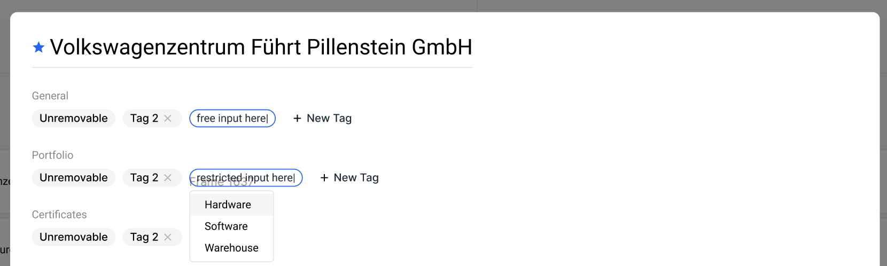

# Take-home test Frontend


## Overview

This is a takehome test for candidates applying for a frontend engineer position at Lhotse.

Our tech stack is:
  * React (CRA)
  * Typescript
  * TailwindCSS
  * React query + axios
  * Cypress (for e2e)
  * React testing library (for unit test)
## Description 

At Lhotse we have to find the most efficient and simple ways for the users to interact with their supplier databases. One of the features created for this purpose is the **tag** based clasification.



### What do you need to do:
1. Create a React app that displays the follow supplier data in the same way as is shown in the image above:

```javascript
const supplier = {
    'name': 'Volkswagenzentrum Berlin GmbH'
    'tags-general': [{
        'id': 1,
        'name': 'volkswagen',
        'type': 'supplierBranch-general'
    },
    {
        'id': 2,
        'name': 'cars',
        'type': 'supplierBranch-general'
    }],
    'tags-certificates': [{
        'id': 1,
        'name': 'ISO 9001',
        'type': 'supplierBranch-certificates'
    }],
    'tags-portfolio': [],

}
```

2. When *hovering* over a tag, the cross to delete icon should appear. And when clicking on it, it should remove the tag. **Except** it is the **first** tag

3. When clicking on "+ New Tag" an input should appear:
 * If it's a *general* tag, it should be a free text input. 
 * If not, when typing it should suggest a name and allow only to choose one of the suggestions.

```javascript
const suggestedTagsPortfolio = ['European', 'Eco-friendly', 'German']
const suggestedTagsCertifications = ['ISO 9001', 'Vegan', 'Organic']
```

4. When pressing *enter*, it should add the tag to the corresponding array.

5. If the user instead presses *tab*, it should add the tag **and** open a new input to add another tag.

#### Notes
At the beginning of this test we've described our stack. But feel free to add any extra tools or libraries you see fit.
